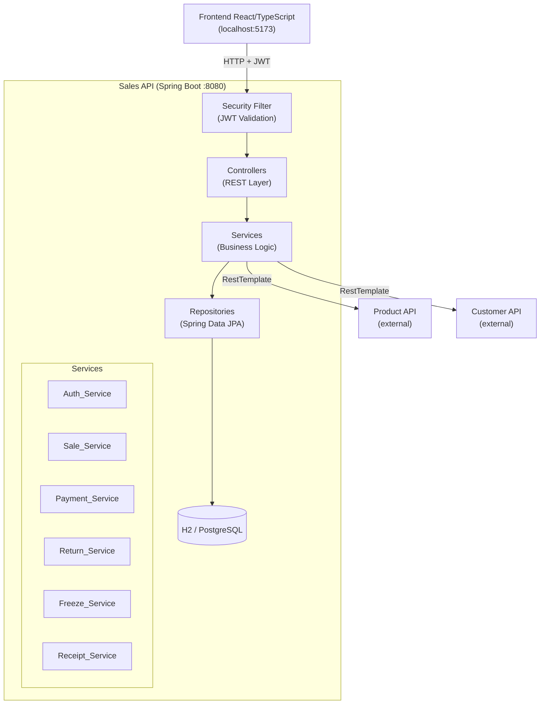
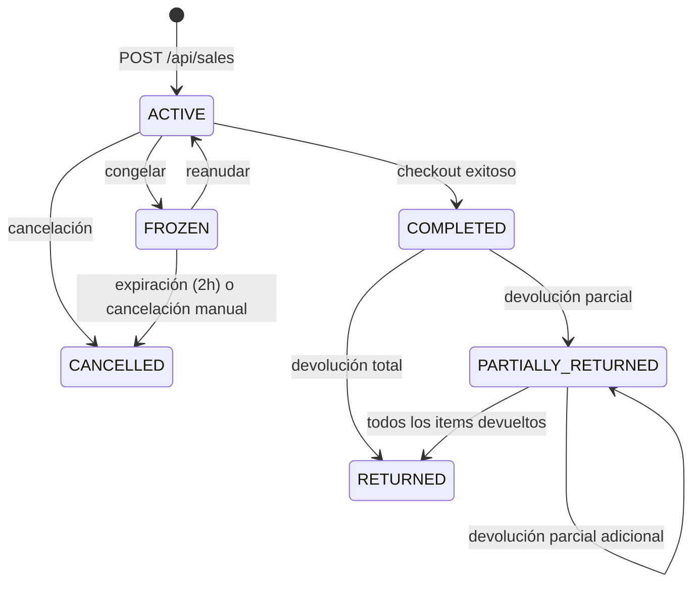

# Design Document — POS MERCATO Backend

## Overview

El **POS MERCATO Backend** es una API REST construida con **Java 17 + Spring Boot 3.x** que gestiona el ciclo de vida completo de las transacciones de venta en los terminales POS de un supermercado. Actúa como capa de orquestación entre el frontend React/TypeScript y dos APIs externas: la **Product API** (catálogo, stock y precios) y la **Customer API** (registro de clientes y estado de crédito).

### Responsabilidades principales

- Autenticar cajeros y administradores mediante JWT (HS256).
- Crear y gestionar ventas (ACTIVE → COMPLETED / CANCELLED / FROZEN / RETURNED / PARTIALLY_RETURNED).
- Procesar pagos en efectivo (CASH) y a crédito (CREDIT).
- Congelar y reanudar ventas; expirar automáticamente las ventas congeladas.
- Procesar devoluciones totales y parciales con restauración de stock.
- Generar recibos de venta y devolución con Transaction_ID único.
- Exponer documentación OpenAPI 3.0 / Swagger UI.

### Decisiones de diseño clave

| Decisión | Rationale |
|---|---|
| Aritmética en centavos (long) | Evita errores de punto flotante en cálculos monetarios |
| Snapshot de precio en SaleItem | El precio al momento de agregar queda fijo; cambios posteriores en Product_API no afectan la venta |
| JWT stateless (HS256) | Sin sesiones en servidor; escala horizontalmente |
| H2 embebido en dev/test | Permite ejecutar tests sin infraestructura externa |
| WireMock en tests de integración | Simula Product_API y Customer_API de forma determinista |
| `@ControllerAdvice` global | Formato de error JSON consistente en todos los endpoints |

---

## Architecture

### Diagrama de componentes



### Diagrama de estados de una Sale



### Capas de la aplicación

```
com.mercato.pos
├── config/          # SecurityConfig, CorsConfig, RestTemplateConfig, OpenApiConfig
├── controller/      # AuthController, ProductController, CustomerController,
│                    # SaleController, CheckoutController, ReturnController,
│                    # FreezeController, ReceiptController
├── service/         # AuthService, SaleService, PaymentService, ReturnService,
│                    # FreezeService, ReceiptService, ProductClientService,
│                    # CustomerClientService
├── repository/      # SaleRepository, SaleItemRepository, ReceiptRepository,
│                    # ReturnRecordRepository
├── model/           # Sale, SaleItem, Receipt, ReturnRecord, User (in-memory)
├── dto/             # Request/Response DTOs
├── exception/       # Custom exceptions + GlobalExceptionHandler
├── scheduler/       # FrozenSaleExpirationScheduler
└── util/            # MoneyCalculator (centavos ↔ BigDecimal)
```

---

## Components and Interfaces

### REST Endpoints

#### Auth

| Method | Path | Auth | Description |
|--------|------|------|-------------|
| POST | `/api/auth/login` | No | Autenticación; retorna JWT |

#### Products

| Method | Path | Auth | Description |
|--------|------|------|-------------|
| GET | `/api/products/search?name=` | JWT | Búsqueda por nombre (parcial) |
| GET | `/api/products/search?barcode=` | JWT | Búsqueda por barcode (exacto) |

#### Customers

| Method | Path | Auth | Description |
|--------|------|------|-------------|
| GET | `/api/customers/search?name=` | JWT | Búsqueda por nombre (parcial) |
| GET | `/api/customers/search?document=` | JWT | Búsqueda por documento (exacto) |

#### Sales

| Method | Path | Auth | Description |
|--------|------|------|-------------|
| POST | `/api/sales` | JWT | Crear nueva venta |
| GET | `/api/sales/{saleId}` | JWT | Obtener venta por ID |
| POST | `/api/sales/{saleId}/items` | JWT | Agregar item |
| PUT | `/api/sales/{saleId}/items/{itemId}` | JWT | Actualizar cantidad de item |
| DELETE | `/api/sales/{saleId}/items/{itemId}` | JWT | Eliminar item |
| POST | `/api/sales/{saleId}/checkout` | JWT | Procesar pago (CASH o CREDIT) |
| POST | `/api/sales/{saleId}/cancel` | JWT | Cancelar venta |
| POST | `/api/sales/{saleId}/freeze` | JWT | Congelar venta |
| POST | `/api/sales/{saleId}/resume` | JWT | Reanudar venta congelada |
| GET | `/api/sales/frozen?terminalId=` | JWT | Listar ventas congeladas por terminal |
| POST | `/api/sales/{saleId}/return` | JWT | Devolución total |
| POST | `/api/sales/{saleId}/return/partial` | JWT | Devolución parcial |

#### Receipts

| Method | Path | Auth | Description |
|--------|------|------|-------------|
| GET | `/api/receipts/{transactionId}` | JWT | Consultar recibo por Transaction_ID |

### Interfaces de servicio internas

```java
// Auth
interface AuthService {
    LoginResponse login(LoginRequest request);
}

// Sale lifecycle
interface SaleService {
    SaleResponse createSale(CreateSaleRequest request, String cashierId);
    SaleResponse getSale(String saleId);
    SaleResponse addItem(String saleId, AddItemRequest request);
    SaleResponse updateItem(String saleId, String itemId, UpdateItemRequest request);
    SaleResponse removeItem(String saleId, String itemId);
    SaleResponse cancelSale(String saleId, CancelSaleRequest request);
}

// Payment
interface PaymentService {
    ReceiptResponse checkout(String saleId, CheckoutRequest request);
}

// Returns
interface ReturnService {
    ReceiptResponse fullReturn(String saleId, ReturnRequest request);
    ReceiptResponse partialReturn(String saleId, PartialReturnRequest request);
}

// Freeze
interface FreezeService {
    SaleResponse freezeSale(String saleId);
    SaleResponse resumeSale(String saleId);
    List<SaleResponse> getFrozenSales(String terminalId);
    void expireOldFrozenSales(); // invocado por scheduler
}

// Receipt
interface ReceiptService {
    Receipt generateSaleReceipt(Sale sale, PaymentDetails payment);
    Receipt generateReturnReceipt(Sale sale, List<ReturnItem> returnedItems, String reason);
    ReceiptResponse getReceipt(String transactionId);
}

// External clients
interface ProductClientService {
    List<ProductDto> searchByName(String name);
    ProductDto searchByBarcode(String barcode);
    ProductDto getProduct(String productId);
    void decrementStock(String productId, int quantity);
    void incrementStock(String productId, int quantity);
}

interface CustomerClientService {
    List<CustomerDto> searchByName(String name);
    CustomerDto searchByDocument(String document);
    CustomerDto getCustomer(String customerId);
}
```

### Clientes HTTP externos

Los clientes `ProductClientService` y `CustomerClientService` usan `RestTemplate` con:
- Timeout de conexión y lectura configurables (`product-api.timeout-ms`, `customer-api.timeout-ms`).
- Manejo de `HttpClientErrorException` y `HttpServerErrorException` para propagar errores 4xx/5xx.
- Manejo de `ResourceAccessException` para retornar HTTP 503 en caso de timeout o conexión rechazada.

---

## Data Models

### Entidades JPA

#### Sale

```java
@Entity
@Table(name = "sales")
public class Sale {
    @Id
    private String id;                    // UUID

    private String terminalId;            // NOT NULL
    private String cashierId;             // NOT NULL (del JWT)
    private String customerId;            // NULLABLE

    @Enumerated(EnumType.STRING)
    private SaleStatus status;            // ACTIVE, COMPLETED, CANCELLED, FROZEN,
                                          // RETURNED, PARTIALLY_RETURNED

    @OneToMany(mappedBy = "sale", cascade = CascadeType.ALL, orphanRemoval = true)
    private List<SaleItem> items;

    // Totales en centavos (long) — internos
    private long subtotalCents;
    private long taxCents;
    private long discountCents;
    private long totalCents;

    // Configuración de descuento
    private String discountType;          // "PERCENTAGE" | "FIXED" | null
    private BigDecimal discountValue;     // porcentaje o monto fijo

    @Column(precision = 19, scale = 2)
    private BigDecimal taxRate;           // default 0.19

    private String paymentType;           // "CASH" | "CREDIT" | null
    private String creditReferenceNumber; // solo CREDIT
    private String transactionId;         // generado al COMPLETED

    private String cancellationReason;
    private LocalDateTime frozenAt;
    private LocalDateTime createdAt;
    private LocalDateTime updatedAt;
    private LocalDateTime completedAt;
}
```

#### SaleItem

```java
@Entity
@Table(name = "sale_items")
public class SaleItem {
    @Id
    private String id;                    // UUID

    @ManyToOne(fetch = FetchType.LAZY)
    private Sale sale;

    private String productId;             // NOT NULL
    private String productName;           // snapshot
    private String barcode;               // snapshot

    @Column(precision = 19, scale = 2)
    private BigDecimal unitPrice;         // snapshot al momento de agregar

    private long unitPriceCents;          // snapshot en centavos

    private int quantity;                 // >= 1

    @Column(precision = 19, scale = 2)
    private BigDecimal lineTotal;         // unitPrice × quantity (2 decimales)

    private long lineTotalCents;          // unitPriceCents × quantity
}
```

#### Receipt

```java
@Entity
@Table(name = "receipts")
public class Receipt {
    @Id
    private String id;                    // UUID

    private String transactionId;         // único, generado al checkout
    private String saleId;
    private String receiptType;           // "SALE" | "RETURN" | "PARTIAL_RETURN"

    @Column(columnDefinition = "TEXT")
    private String receiptJson;           // snapshot JSON del recibo completo

    private LocalDateTime generatedAt;
    private String originalTransactionId; // solo para recibos de devolución
}
```

#### ReturnRecord

```java
@Entity
@Table(name = "return_records")
public class ReturnRecord {
    @Id
    private String id;                    // UUID

    private String saleId;
    private String productId;
    private int quantityReturned;
    private String returnReason;
    private LocalDateTime returnedAt;
    private String receiptId;
}
```

### DTOs principales

```java
// Request
record LoginRequest(String username, String password) {}
record CreateSaleRequest(String terminalId, String customerId) {}
record AddItemRequest(String productId, String barcode, int quantity) {}
record UpdateItemRequest(int quantity) {}
record CheckoutRequest(String paymentType, BigDecimal amountReceived) {}
record CancelSaleRequest(String cancellationReason) {}
record ReturnRequest(String returnReason) {}
record PartialReturnRequest(List<ReturnItemRequest> items) {}
record ReturnItemRequest(String productId, int quantity, String returnReason) {}

// Response
record LoginResponse(String token, String role, UserDto user) {}
record UserDto(String id, String username, String displayName) {}
record SaleResponse(String id, String terminalId, String cashierId,
                    String customerId, String status, List<SaleItemDto> items,
                    BigDecimal subtotal, BigDecimal tax, BigDecimal discount,
                    BigDecimal total, String paymentType, LocalDateTime createdAt) {}
record SaleItemDto(String id, String productId, String productName,
                   BigDecimal unitPrice, int quantity, BigDecimal lineTotal) {}
record ReceiptResponse(String transactionId, String creditReferenceNumber,
                       String receiptType, Object receiptData) {}
record ErrorResponse(String message, String timestamp, String path) {}
```

### Esquema de base de datos (compatible PostgreSQL)

```sql
CREATE TABLE sales (
    id                      VARCHAR(36) PRIMARY KEY,
    terminal_id             VARCHAR(100) NOT NULL,
    cashier_id              VARCHAR(100) NOT NULL,
    customer_id             VARCHAR(100),
    status                  VARCHAR(30) NOT NULL,
    subtotal_cents          BIGINT NOT NULL DEFAULT 0,
    tax_cents               BIGINT NOT NULL DEFAULT 0,
    discount_cents          BIGINT NOT NULL DEFAULT 0,
    total_cents             BIGINT NOT NULL DEFAULT 0,
    discount_type           VARCHAR(20),
    discount_value          DECIMAL(19,2),
    tax_rate                DECIMAL(19,2) NOT NULL DEFAULT 0.19,
    payment_type            VARCHAR(10),
    credit_reference_number VARCHAR(100),
    transaction_id          VARCHAR(100) UNIQUE,
    cancellation_reason     VARCHAR(255),
    frozen_at               TIMESTAMP,
    created_at              TIMESTAMP NOT NULL,
    updated_at              TIMESTAMP NOT NULL,
    completed_at            TIMESTAMP
);

CREATE TABLE sale_items (
    id                VARCHAR(36) PRIMARY KEY,
    sale_id           VARCHAR(36) NOT NULL REFERENCES sales(id),
    product_id        VARCHAR(100) NOT NULL,
    product_name      VARCHAR(255) NOT NULL,
    barcode           VARCHAR(100),
    unit_price        DECIMAL(19,2) NOT NULL,
    unit_price_cents  BIGINT NOT NULL,
    quantity          INT NOT NULL CHECK (quantity >= 1),
    line_total        DECIMAL(19,2) NOT NULL,
    line_total_cents  BIGINT NOT NULL
);

CREATE TABLE receipts (
    id                       VARCHAR(36) PRIMARY KEY,
    transaction_id           VARCHAR(100) UNIQUE NOT NULL,
    sale_id                  VARCHAR(36) NOT NULL,
    receipt_type             VARCHAR(20) NOT NULL,
    receipt_json             TEXT NOT NULL,
    generated_at             TIMESTAMP NOT NULL,
    original_transaction_id  VARCHAR(100)
);

CREATE TABLE return_records (
    id                VARCHAR(36) PRIMARY KEY,
    sale_id           VARCHAR(36) NOT NULL REFERENCES sales(id),
    product_id        VARCHAR(100) NOT NULL,
    quantity_returned INT NOT NULL CHECK (quantity_returned >= 1),
    return_reason     VARCHAR(500) NOT NULL,
    returned_at       TIMESTAMP NOT NULL,
    receipt_id        VARCHAR(36)
);
```

### Usuarios en memoria (Auth_Service)

Los usuarios se almacenan en memoria (no en base de datos) para simplificar el prototipo:

```java
// Hardcoded en AuthService
Map<String, User> users = Map.of(
    "admin",  new User("1", "admin",  encode("admin123"),  "ADMIN",    "Administrador", true),
    "cajero", new User("2", "cajero", encode("cajero123"), "CASHIER",  "Cajero 1",      true)
);
```

### Utilidad de cálculo monetario

```java
public class MoneyCalculator {
    // BigDecimal → centavos
    public static long toCents(BigDecimal amount) { ... }
    // centavos → BigDecimal con 2 decimales
    public static BigDecimal fromCents(long cents) { ... }
    // Recalcula todos los totales de una Sale
    public static void recalculateTotals(Sale sale) { ... }
}
```

---

## Correctness Properties

*Una propiedad es una característica o comportamiento que debe mantenerse verdadero en todas las ejecuciones válidas del sistema — esencialmente, una declaración formal sobre lo que el sistema debe hacer. Las propiedades sirven como puente entre las especificaciones legibles por humanos y las garantías de corrección verificables por máquina.*

### Property 1: Subtotal es consistente con los items de la venta

*Para cualquier* Sale con una lista arbitraria de SaleItems (cada uno con `unitPriceCents` ≥ 0 y `quantity` ≥ 1), el `subtotalCents` de la Sale debe ser igual a la suma de `(unitPriceCents × quantity)` de todos sus items.

**Validates: Requirements 6.5, 7.1**

### Property 2: Tax se calcula correctamente sobre el subtotal

*Para cualquier* `subtotalCents` ≥ 0 y `taxRate` ∈ [0, 1], el `taxCents` calculado debe ser igual a `round(subtotalCents × taxRate)`.

**Validates: Requirements 7.2**

### Property 3: Total = Subtotal + Tax − Discount

*Para cualquier* combinación de `subtotalCents` ≥ 0, `taxCents` ≥ 0 y `discountCents` ∈ [0, subtotalCents + taxCents], el `totalCents` debe ser igual a `subtotalCents + taxCents − discountCents`.

**Validates: Requirements 7.5**

### Property 4: Conversión centavos ↔ BigDecimal es un round-trip

*Para cualquier* valor monetario expresado como `long` de centavos no negativo, convertir a `BigDecimal` con 2 decimales y volver a centavos debe producir el valor original: `toCents(fromCents(x)) == x`.

**Validates: Requirements 7.6, 7.7**

### Property 5: Producto duplicado incrementa cantidad, no crea nuevo item

*Para cualquier* Sale en estado ACTIVE que ya contiene un SaleItem con `productId = P` y `quantity = q1`, al agregar otro item con el mismo `productId = P` y `quantity = q2` (q2 ≥ 1), el número total de SaleItems en la Sale no debe cambiar y la cantidad del item existente debe ser `q1 + q2`.

**Validates: Requirements 6.2**

### Property 6: Descuento porcentual se calcula sobre el subtotal

*Para cualquier* `subtotalCents` ≥ 0 y porcentaje de descuento `p` ∈ [0, 100], el `discountCents` calculado debe ser igual a `round(subtotalCents × p / 100)`.

**Validates: Requirements 7.3**

### Property 7: Cambio en pago CASH es siempre no negativo

*Para cualquier* `totalCents` ≥ 0 y `amountReceivedCents` ≥ `totalCents`, el cambio calculado (`amountReceivedCents − totalCents`) debe ser mayor o igual a cero.

**Validates: Requirements 8.2, 8.4**

### Property 8: Devolución parcial no excede cantidad comprada

*Para cualquier* Sale con items y cualquier conjunto de ReturnRecords existentes, la suma de `quantityReturned` de todos los ReturnRecords de un `productId` dado más la cantidad solicitada en una nueva devolución parcial no debe exceder la `quantity` originalmente comprada de ese producto en la Sale.

**Validates: Requirements 14.2**

### Property 9: JWT contiene los campos requeridos

*Para cualquier* login exitoso con credenciales válidas (cualquier usuario habilitado del sistema), el JWT retornado debe contener los campos `sub`, `username`, `role` y `exp` en su payload decodificado.

**Validates: Requirements 1.2**

### Property 10: Recibo de venta contiene todos los campos obligatorios

*Para cualquier* Sale completada exitosamente (con `paymentType` CASH o CREDIT, con cualquier combinación de items válidos), el recibo generado debe contener: `transactionId` (no nulo y único), `terminalId`, `cashierId`, `items` (lista no vacía), `subtotal`, `tax`, `total`, `paymentType` y `generatedAt`.

**Validates: Requirements 10.1, 10.2**

---

## Error Handling

### Jerarquía de excepciones personalizadas

```
RuntimeException
├── SaleNotFoundException          → HTTP 404
├── ReceiptNotFoundException       → HTTP 404
├── SaleNotActiveException         → HTTP 422
├── SaleNotFrozenException         → HTTP 422
├── SaleNotCompletedException      → HTTP 422
├── SaleAlreadyReturnedException   → HTTP 422
├── InsufficientStockException     → HTTP 409
├── InsufficientPaymentException   → HTTP 422
├── InvalidQuantityException       → HTTP 400
├── CreditNotApprovedException     → HTTP 422
├── CustomerRequiredException      → HTTP 422
├── EmptySaleException             → HTTP 422
├── ExternalServiceException       → HTTP 503
└── ValidationException            → HTTP 400
```

### GlobalExceptionHandler (`@ControllerAdvice`)

Captura todas las excepciones y retorna:

```json
{
  "message": "<descripción legible>",
  "timestamp": "2024-01-15T10:30:00Z",
  "path": "/api/sales/123/checkout"
}
```

Para errores de validación de Bean Validation (HTTP 400):

```json
{
  "message": "Errores de validación",
  "timestamp": "...",
  "path": "...",
  "errors": [
    { "field": "terminalId", "message": "no debe estar vacío" }
  ]
}
```

### Manejo de errores de APIs externas

| Escenario | Comportamiento |
|---|---|
| Product_API / Customer_API retorna 4xx | Propagar el mismo código HTTP al cliente |
| Product_API / Customer_API retorna 5xx | Retornar HTTP 503 con mensaje descriptivo |
| Timeout de conexión/lectura | Retornar HTTP 503 con `{"message": "Servicio de productos/clientes no disponible"}` |
| Stock insuficiente en checkout | HTTP 409 con lista de productos sin stock |

### Logging

- Todos los errores HTTP 5xx se registran con nivel `ERROR` incluyendo stack trace completo.
- Las llamadas a APIs externas se registran con nivel `DEBUG` (URL, método, tiempo de respuesta).
- Las transiciones de estado de Sale se registran con nivel `INFO`.

---

## Testing Strategy

### Enfoque dual: tests unitarios + tests de integración

La suite de tests combina tests unitarios (aislados con Mockito) y tests de integración (con H2 + WireMock) para lograr cobertura completa.

#### Tests unitarios (JUnit 5 + Mockito)

Cada método público de los servicios tiene al menos un test unitario. Los tests cubren:

- **AuthService**: login exitoso (ADMIN, CASHIER), credenciales incorrectas, cuenta deshabilitada, campos del JWT.
- **SaleService**: creación de venta, agregar/actualizar/eliminar items, recálculo de totales, validaciones de estado, cancelación.
- **PaymentService**: checkout CASH (exitoso, monto insuficiente, sin items, stock insuficiente), checkout CREDIT (exitoso, sin cliente, crédito no aprobado).
- **ReturnService**: devolución total (exitosa, venta no COMPLETED, ya devuelta), devolución parcial (exitosa, excede cantidad, razón faltante).
- **FreezeService**: congelar (exitoso, no ACTIVE), reanudar (exitoso, no FROZEN), expiración automática.
- **ReceiptService**: generación de recibo de venta (CASH y CREDIT), recibo de devolución, consulta por transactionId.
- **MoneyCalculator**: conversión centavos ↔ BigDecimal, recálculo de totales con distintos escenarios.

Todas las llamadas a `ProductClientService` y `CustomerClientService` se mockean con Mockito.

#### Tests de integración (`@SpringBootTest` + H2 + WireMock)

Flujos completos de negocio:

1. **Flujo CASH**: crear venta → agregar items → checkout CASH → verificar recibo y Transaction_ID.
2. **Flujo CREDIT**: crear venta → asociar cliente → agregar items → checkout CREDIT → verificar Credit_Reference.
3. **Flujo freeze**: crear venta → agregar items → congelar → reanudar → checkout.
4. **Flujo devolución total**: completar venta → devolución total → verificar stock restaurado.
5. **Flujo devolución parcial**: completar venta → devolver 2 de 5 items → verificar stock parcialmente restaurado.
6. **Flujo cancelación**: crear venta → agregar items → cancelar → verificar que no se puede modificar.

#### Tests de propiedades (JUnit 5 + jqwik)

Se usa **jqwik** como librería de property-based testing. Cada test se ejecuta con un mínimo de **100 iteraciones**.

Cada test de propiedad está etiquetado con:
```
// Feature: pos-mercato-backend, Property N: <texto de la propiedad>
```

| Propiedad | Test |
|---|---|
| Property 1: Subtotal consistente con items | Generar lista aleatoria de SaleItems; verificar que subtotal = Σ(unitPriceCents × quantity) |
| Property 2: Tax correcto | Generar subtotalCents y taxRate aleatorios; verificar taxCents = round(subtotal × rate) |
| Property 3: Total = Subtotal + Tax − Discount | Generar los tres componentes; verificar la ecuación |
| Property 4: Round-trip centavos ↔ BigDecimal | Generar long aleatorio ≥ 0; verificar toCents(fromCents(x)) == x |
| Property 5: Producto duplicado incrementa cantidad | Generar Sale con item existente; agregar mismo productId; verificar count y quantity |
| Property 6: Descuento porcentual | Generar subtotal y porcentaje; verificar cálculo |
| Property 7: Cambio CASH ≥ 0 | Generar total y amountReceived ≥ total; verificar cambio ≥ 0 |
| Property 8: Devolución parcial no excede compra | Generar Sale con items y ReturnRecords; verificar invariante |
| Property 9: JWT contiene campos requeridos | Generar credenciales válidas; verificar claims del JWT |
| Property 10: Recibo contiene campos obligatorios | Generar Sale completada; verificar campos del recibo |

#### Cobertura con JaCoCo

| Capa | Cobertura mínima |
|---|---|
| Capa de servicios | 90% de líneas |
| Proyecto completo | 80% de líneas |

La configuración de JaCoCo en `pom.xml` incluye reglas de fallo de build si no se alcanza la cobertura mínima.

### Configuración de propiedades de aplicación

```yaml
# application.yml
server:
  port: 8080

spring:
  datasource:
    url: jdbc:h2:mem:posdb
    driver-class-name: org.h2.Driver
  jpa:
    hibernate:
      ddl-auto: create-drop
    show-sql: false

jwt:
  secret: ${JWT_SECRET:pos-mercato-secret-key-256-bits-minimum}
  expiration-ms: 86400000  # 24 horas

product-api:
  base-url: ${PRODUCT_API_URL:http://localhost:8081}
  timeout-ms: 5000

customer-api:
  base-url: ${CUSTOMER_API_URL:http://localhost:8082}
  timeout-ms: 5000

pos:
  tax-rate: 0.19
  frozen-sale-expiration-hours: 2
  frozen-sale-check-interval-ms: 300000  # 5 minutos
```
